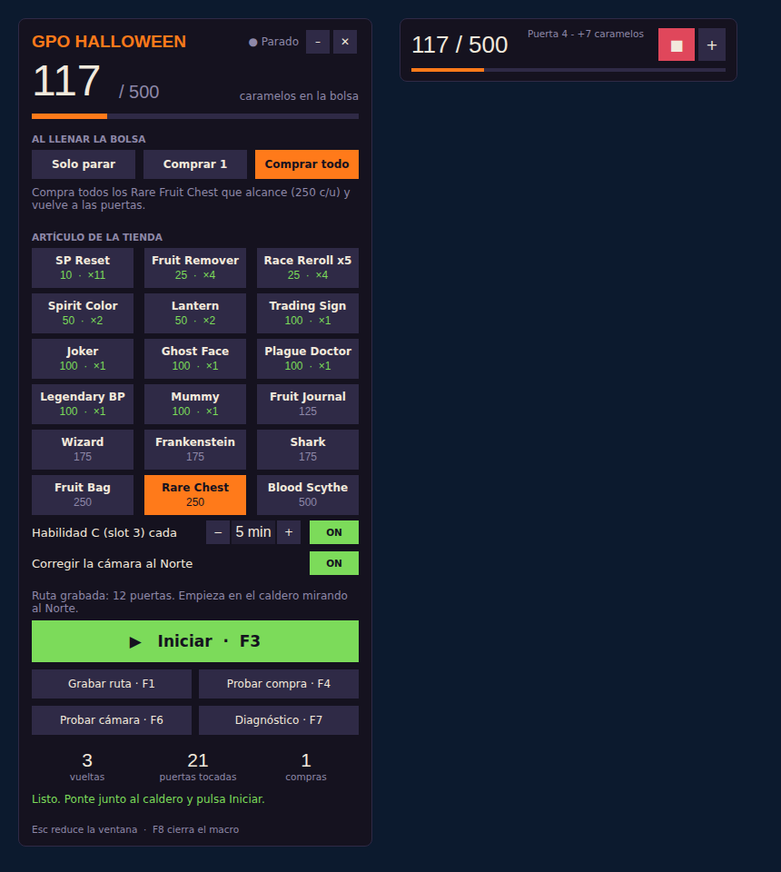

# Macro GPO Halloween (AutoHotkey v2)

Macro automático para recolectar caramelos en Spooksville y canjearlos con la bruja.
Solo **lee la pantalla** (OCR de Windows) y **simula teclado y ratón**. No inyecta nada en el juego.

> Usar macros en GPO puede costarte un baneo. Si no quieres arriesgar tu cuenta principal, úsalo en una secundaria.

## Modo asistido (`GPO_Asistido.ahk`) — recomendado
**Tú caminas por las calles; el macro hace el resto.** No usa rutas grabadas ni la cámara.
- Toca cada puerta en cuanto aparece **"E Knock"** (la detecta por imagen y, si no, leyendo el texto).
- Antes de cada E comprueba que la **bolsa** está en la mano.
- Usa la **habilidad C** cada X minutos y vuelve a la bolsa.
- Cuando la bolsa está **llena**, suena un aviso: ve con la bruja y pulsa **F4**. Abre la tienda, compra el artículo elegido y la cierra.

| Tecla | Acción |
|---|---|
| F3 | Activar / pausar |
| F4 | Comprar ahora (pegado a la bruja) |
| F7 | Diagnóstico: contador, aviso "E Knock", slot equipado |
| F8 | Salir |

**Prueba de 10 segundos:** abre `GPO_Asistido`, pulsa **F3** y camina hasta una puerta. Al aparecer "E Knock", debe tocarla sola.
Si no lo hace, ponte delante de la puerta, pulsa **F7** y manda una captura.

Más abajo está el macro completo (`GPO_Halloween.ahk`), que además intenta caminar solo con una ruta grabada.

## Qué hace solo
- **Busca las puertas mientras camina:** lee la pantalla unas 10 veces por segundo y, en cuanto aparece el aviso **"E Knock"** (`Lib/knock.png`), se detiene, toca y sigue la ruta. No hace falta pulsar E al grabar, aunque si lo haces también cuenta.
- Toca cada puerta y lee el resultado:
  - **Caramelos ganados (de 1 a 15) o robados**: cualquier cambio en el contador cuenta como puerta tocada y la marca como en recarga.
  - **"You already visited… Come back in 124s"**: anota esos 124 s y no la vuelve a tocar hasta que pasen.
- Lee el contador **"X/500 Candies"**. Cuando la bolsa está llena (o sale *"Your candy basket is full!"*), deja de tocar puertas y termina la vuelta hasta la bruja.
- **Compra solo:** abre la Halloween Shop, hace scroll hasta el artículo, lo compra (todas las veces que alcancen los caramelos) y cierra la tienda.
- Si todas las puertas están en recarga, espera junto a la bruja.
- **Cada 5 minutos usa la habilidad C:** saca la fruta (slot 3), pulsa C y vuelve a la bolsa (slot 2).
  Lo hace al empezar y luego en la siguiente parada (una puerta o el caldero), nunca caminando.
  Se ajusta en `HABILIDAD_CADA_MIN`, `SLOT_HABILIDAD`, `TECLA_HABILIDAD` y `ESPERA_HABILIDAD`; con `HABILIDAD_CADA_MIN := 0` se desactiva.
- **Corrige la cámara** antes de cada vuelta: busca la "N" blanca de la brújula (`Lib/norte.png`) y la deja **en el mismo sitio que cuando grabaste la ruta**. Solo corrige desvíos pequeños; si no ve la N, no gira.
- **Comprueba que la bolsa está en la mano** (slot 2, borde blanco) antes de cada E. Con la fruta equipada, E sería un ataque y no tocaría la puerta.
- Si pulsaste E varias veces en la misma puerta al grabar, cuenta como **una sola puerta**. Los números (1-9) y la C que pulses al grabar se ignoran: de eso se encarga el macro.
- Si Roblox se desconecta, pulsa "Reconnect" si aparece y se detiene.

Lo único que tienes que hacer tú es **grabar la ruta una vez**, porque un macro externo no puede saber en qué coordenadas está tu personaje.

## Requisitos
- Windows 10/11 y **AutoHotkey v2** (https://www.autohotkey.com).
- La carpeta completa: `GPO_Halloween.ahk` **y la carpeta `Lib`** (dentro va `OCR.ahk`, el lector de pantalla).
- Roblox en **pantalla completa a 1920×1080**.
- La **bolsa de caramelos equipada**.

## La ventana

*(Vista previa hecha con una maqueta; en Windows las letras pueden verse un poco distintas.)*

- **Caramelos en la bolsa**, en grande, con una barra que se va llenando.
- **Al llenar la bolsa:** *Solo parar*, *Comprar 1* (y para) o *Comprar todo* (y sigue).
- **Artículo de la tienda:** pulsa una ficha para elegirla (queda en naranja). El número en verde (`×2`) es **cuántas te alcanzan** con los caramelos que llevas.
- **Habilidad C:** − / + cambia cada cuántos minutos; ON/OFF la activa o la desactiva.
- **Corregir la cámara al Norte:** ON/OFF.
- **Buscar puertas mientras camina:** ON/OFF.
- **Iniciar** (verde) / **Parar** (rojo), y botones para grabar la ruta, probar la compra, probar la cámara y ver el diagnóstico.
- Abajo: vueltas, puertas tocadas, compras y qué está haciendo ahora.

**Comodidad:**
- Arrastra la ventana desde cualquier parte que no sea un botón.
- **–** o **Esc** la reducen a una barra pequeña; **+** la vuelve a abrir.
- Al pulsar **Iniciar** se reduce sola a la barra pequeña, para no tapar el juego, y al parar se vuelve a abrir.
- Recuerda su posición y tus opciones (en `config.ini`).

**No pongas la ventana encima del centro de la pantalla:** el macro lee esa zona del juego. Déjala a la derecha.

## Teclas
| Tecla | Acción |
|---|---|
| F1 | Grabar / terminar la **ruta** de puertas |
| F2 | Grabar / terminar una compra manual (plan B, solo si la compra automática falla) |
| F3 | Iniciar / parar |
| F4 | Probar solo la compra (ponte junto a la bruja) |
| F6 | Probar el alineado de cámara al Norte |
| F7 | Diagnóstico: muestra qué lee de la pantalla y lo guarda en `diagnostico.txt` |
| F8 | Cerrar el macro |

## Primeros pasos
1. **Prueba la lectura:** mirando al Norte, pulsa **F7** en el juego. Debe mostrar tu contador (por ejemplo `219/500`) y "N en x=…".
   Si dice "NO LEÍDO", mándame el `diagnostico.txt`.
2. **Prueba la cámara:** gira la cámara **un poco** (la N tiene que seguir cerca del centro) y pulsa **F6**. Debe volver a centrar la N.
   Si se pasa de largo o gira muy lento, cambia `FACTOR_GIRO`.
3. **Graba la ruta (F1):**
   - Empieza **pegado al caldero de la bruja**, con la cámara en Norte (pulsa F6 antes).
   - Camina a cada puerta y pulsa **E** delante de ella (cada E es una puerta).
   - **No muevas la cámara** mientras grabas.
   - Termina **chocando otra vez contra el caldero** y pulsa F1.
   - Chocar contra paredes y esquinas en el camino ayuda a que el personaje no se desvíe.
4. **Prueba la compra:** junto a la bruja, pulsa **F4**.
5. En la ventana, elige el **modo** y el **artículo**.
6. Vuelve al caldero y pulsa **Iniciar** (o F3). Si cambias de ventana, se detiene solo.

## Cómo grabar la ruta de Spooksville (32 puertas)
Con "Buscar puertas mientras camina" en **ON**, la ruta solo tiene que **pasar por delante de todas las puertas**:
1. Ponte **pegado al caldero**, con la **bolsa en la mano** y la cámara mirando al **Norte**. Pulsa **Grabar ruta** (o F1).
2. Camina hasta la primera calle de casas (la puerta 1 de tu mapa).
3. Recorre cada fila **pegado a las fachadas**, sin pararte: 1 → 8, 9 → 16, 17 → 24 y 25 → 32.
   - Ir rozando las casas hace que el aviso "E Knock" salga en cada puerta, y que el personaje no se desvíe en cada vuelta.
   - **No muevas la cámara.**
4. Vuelve al centro y **choca contra el caldero**. Pulsa **F1**.

Una vuelta de 32 puertas dura más que la recarga de una puerta (unos 2 minutos): al terminar, las primeras ya están listas otra vez.

## Si algo falla
- **No lee el contador o los mensajes:** pulsa F7 en esa situación y mándame `diagnostico.txt` junto con una captura.
- **No encuentra el artículo o no confirma la compra:** mándame una captura justo después de hacer clic en el artículo.
- **El personaje se desvía con las vueltas:** graba una ruta más corta o con más choques contra paredes.
- **Cualquier otra cosa:** mándame `registro.txt`. Ahí queda, con la hora, todo lo que hizo el macro en la última sesión.

Créditos: lectura de pantalla con [OCR de Descolada](https://github.com/Descolada/OCR) (licencia MIT, `Lib/OCR-LICENSE.txt`).
